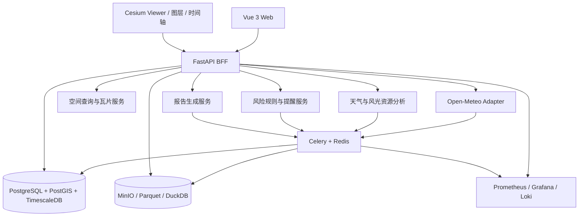

# 系统架构

## 1. 架构目标

架构围绕 V0.2 的数据边界设计：以天气数据采集、质量检查、空间查询、时间序列分析、资源评估、风险规则和报告生成为主，先保证数据可追溯和模块可替换，再扩展更多外部数据源。

## 2. 推荐技术栈

| 层 | 选型 | 作用 |
| --- | --- | --- |
| Web 应用 | Vue 3 + TypeScript + Vite | 中后台页面和组件化开发 |
| 空间引擎 | CesiumJS + vue-cesium | 2D/3D 地球、地形、图层和时间轴 |
| 图表与组件 | Apache ECharts + Arco Design Vue | 趋势、地图侧栏、表格和状态组件 |
| 状态与请求 | Pinia + TanStack Query | 筛选状态、缓存和异步请求 |
| BFF/API | Python FastAPI + Pydantic + SQLAlchemy | 统一接口、数据校验和业务编排 |
| 异步任务 | Celery + Redis | 拉取、回填、质量检查和报告任务 |
| 数据库 | PostgreSQL + PostGIS + TimescaleDB | 关注点、区域、空间对象和时序数据 |
| 文件与分析 | MinIO + Parquet + DuckDB | 原始快照、分析文件和报告中间结果 |
| 观测 | Prometheus + Grafana + Loki | 接口、任务、日志和数据新鲜度监控 |
| 部署 | Docker Compose 起步；Kubernetes + Helm 规模化 | 先降低运维复杂度 |

## 3. 逻辑分层

## 4. 数据流

1. 采集器按模型更新时间拉取 Forecast、Historical、Air Quality、Marine、Flood、Elevation 等数据。
2. 采集任务保存原始响应和请求元数据，失败任务可重试并进入死信队列。
3. 标准化任务完成变量、单位、时区、坐标和质量状态转换，并按统一键去重。
4. 空间服务将关注点、区域和栅格结果按视口切片，Cesium 只加载当前范围。
5. 分析任务将天气序列、地形和区域边界对齐，生成资源统计、对比和风险特征。
6. 风险服务根据变量、阈值、时间窗和区域生成提醒，保留触发证据。
7. 报告任务读取分析和风险结果，生成天气简报、资源评估报告或风险复盘。

## 5. 核心实体

- `organization`：组织和权限边界。
- `watchpoint`：用户维护的关注点、坐标、名称和标签。
- `region`：用户绘制或导入的区域边界。
- `weather_forecast_run`：模型、运行时间、来源和空间分辨率。
- `weather_series`：变量、位置、有效时间、值、单位和质量状态。
- `resource_assessment`：区域、资源类型、统计周期、算法版本和结果。
- `risk_rule` / `risk_event`：阈值、触发条件、证据、状态和提醒记录。
- `scenario`：基准、保守、乐观等情景参数和结果。
- `data_quality_event`：接口或变量的缺失、延迟、异常和恢复记录。
- `report`：报告类型、数据范围、生成版本、导出文件和分享状态。
- `feedback`：用户对结果、提醒或报告的修正意见。

## 6. API 目录

| 方法 | 路径 | 用途 |
| --- | --- | --- |
| GET | `/api/v1/watchpoints` | 关注点列表、筛选和空间范围 |
| POST | `/api/v1/watchpoints` | 新建关注点并触发地理信息补全 |
| GET | `/api/v1/weather/forecast` | 按关注点、区域、时间和变量返回预报 |
| GET | `/api/v1/weather/runs` | 模型运行列表、对比和历史回看 |
| GET | `/api/v1/spatial/layers` | Cesium 图层目录和瓦片地址 |
| GET | `/api/v1/resources/assessment` | 风光资源统计和区域对比 |
| GET | `/api/v1/risks` | 风险规则和已触发事件 |
| POST | `/api/v1/risks/rules` | 创建或更新风险阈值 |
| POST | `/api/v1/scenarios` | 创建并异步运行天气情景 |
| GET | `/api/v1/quality/summary` | 接口、延迟、覆盖率和质量状态 |
| POST | `/api/v1/reports` | 生成天气、资源或风险报告 |

## 7. 部署与安全

- MVP 用一份 Docker Compose 启动 web、api、worker、scheduler、postgres、redis、minio 和观测服务。
- 热数据按时间保留，历史数据按月分区；原始响应写入 MinIO，分析使用 Parquet/DuckDB。
- 查询按坐标网格、变量、时间范围和模型缓存；地图瓦片使用 Nginx 或 CDN 缓存。
- Open-Meteo 地址、内部令牌和通知密钥只放服务端环境变量，不进入浏览器包。
- 所有报告、风险事件和规则变更保留创建人、创建时间、数据版本和规则版本。
