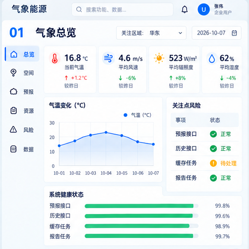
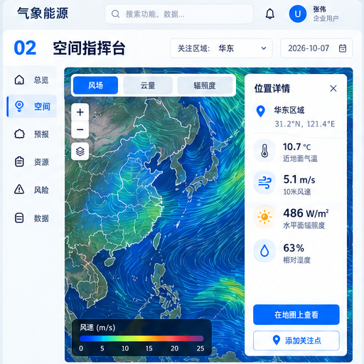
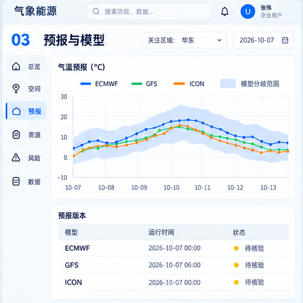
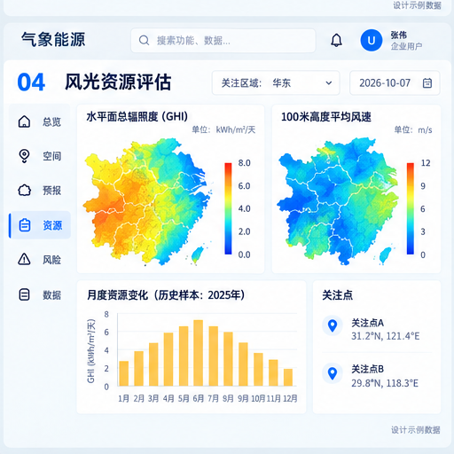
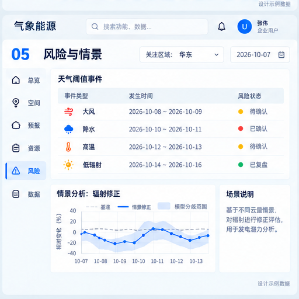
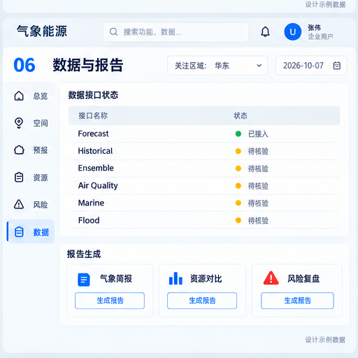

# UI 设计

## 1. 视觉方向

界面采用浅灰工作台、白色卡片、细边框、轻阴影、左侧固定导航和顶部工具栏。视觉重点从旧版的电站运营改为气象、空间、资源和风险，颜色只表达状态或数据类型。

## 2. Design Tokens

| 类别 | Token |
| --- | --- |
| 页面底色 | `#F5F7FB` |
| 卡片 / 边框 | `#FFFFFF` / `#E7ECF3` |
| 主文字 / 次文字 | `#12233F` / `#718096` |
| 主色 / 成功 / 提醒 / 危险 | `#4C7DFF` / `#28B487` / `#F3B544` / `#E96B6B` |
| 气象蓝 / 辐射黄 / 风能青 / 洪水蓝 | `#5DA9E9` / `#F4B740` / `#58B7B0` / `#4E82D8` |
| 圆角 | 卡片 `12px`；控件 `8px` |
| 阴影 | `0 4px 18px rgba(38,58,94,.06)` |
| 布局 | 最小宽度 `1280px`；左导航 `220px`；顶部栏 `64px`；内容边距 `24px` |
| 字体 | Inter + 思源黑体；数字使用等宽数字 |

## 3. 交互原则

- 一屏先看关键指标和风险，再看趋势，最后看明细。
- 地图和时间轴是空间、时间上下文的主交互。
- 颜色在全站保持固定语义，避免同色多义。
- 页面不堆解释性小字，变量口径和算法说明放在字段说明或数据字典。
- 所有预报和分析结果显示模型、更新时间、单位和质量状态。
- 过期、缺失和降级状态直接展示，并提供可执行的恢复入口。

## 4. 页面规格

### P01｜气象总览

目标：30 秒内判断重点区域的天气、数据健康、资源潜力和风险。核心区域包括 KPI 卡、24 小时趋势、关注点风险、接口健康和快捷入口。

### P02｜空间指挥台

目标：在 Cesium 地图中叠加风场、云量、辐射、降水、洪水和空气质量图层。左侧是图层与时间控制，中间是地图，右侧是关注点详情和创建关注点入口。

### P03｜预报与模型

目标：对比 ECMWF、GFS、ICON 等模型，查看变量曲线、集合分歧、置信范围和预报版本。支持模型显隐、变量切换、历史回看和异常点标记。

### P04｜风光资源评估

目标：展示 GHI、DNI、GTI、风速等资源空间分布、月度变化、关注点列表和区域对比。评估结果只描述天气资源潜力，不计算实际电站功率。

### P05｜风险与情景

目标：集中查看天气阈值事件，比较情景影响，并生成可追溯的风险提醒。页面包括风险统计、事件列表、影响范围、情景对比和情景说明。

### P06｜数据与报告

目标：查看接口健康、变量覆盖、模型运行、质量事件和报告生成入口。报告类型包括气象简报、资源评估报告和风险复盘。

> 当前统一视觉稿是一张六屏总览图，开发时按 P01–P06 拆分为独立页面和路由；图片本身作为视觉基准，不替代页面交互规格。
